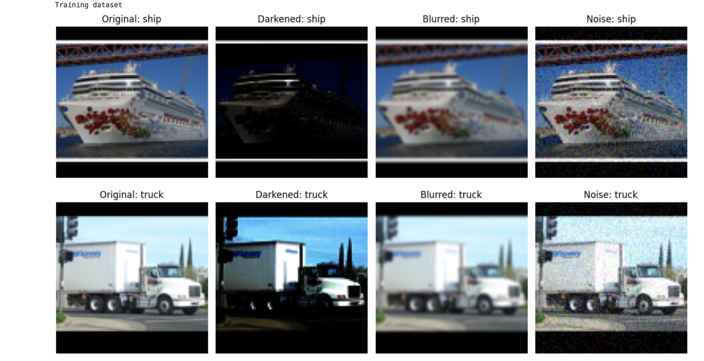
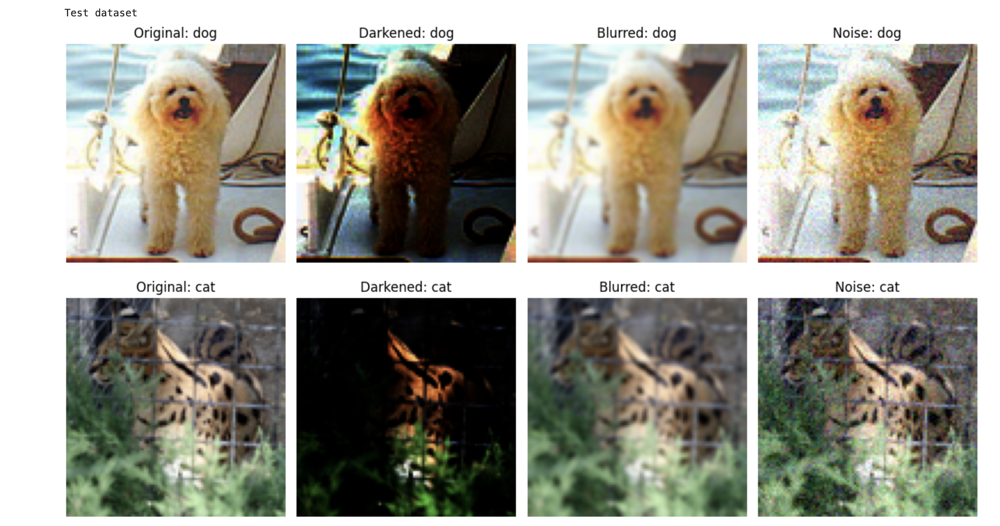
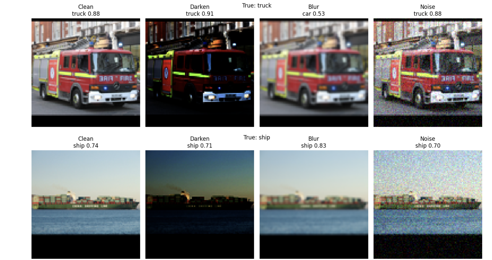

# Robust ResNet Image Corruptions
This project evaluates the robustness of a ResNet-18 that has been trained on clean image datasets and 
corrupted image datasets (noisy, blur, and darkened). A consistency regularization is applied, penalizing
the model for differences between clean and corrupted image predictions. Accuracy is measure across all four
datasets to measure performance under different image corruption conditions. Confidence is also measured to
evaluate the model's certainity in its predictions. 

## Structure
- **'robust_resnet_image_corruption.ipynb'** - main notebook. Includes training and evaluation. Calls **'load_data.py'**  to grab its datasets for the ML training and evaluation pipeline.
- **'load_data.py'** - Loads the STL-10 dataset and generates four test and four training datasets: clean and corrupted (noisy, blur, and darkened) for both training and testing sets. Calls **'filters.py'** and **`corruptor.py'** to achieve this.
- **'filters.py'** - Image corruption filter. Applied gaussian blur, noise, and darkening to an image when called.
- **'corruptor.py'** - Applied the corruption pipeline to the dataset. Calls the **darken, gausblur, gausnoise** functions from **'filters.py'** to achieve this.

## Dataset
The project use the STL-10 dataset via TensorFlow Datasets.

No download is required as the data is directly downloaded via the **load()** method from **tensorflow_datasets** library.

## Dependencies
This project uses the following Python libraries:
- 'torch.utils.data.Dataset'
- 'torch.utils.data.TensorDataset'
- 'torch.utils.data.DataLoader'
- 'torch'
- 'random'
- 'numpy'
- 'cv2'
- 'matplotlib.pyplot'
- 'torch.nn.functional'
- 'torch.nn'

## Instructions
1. Install the dependencies.
2. Run the notebook: **`robust_resnet_image_corruption.ipynb'**

## Results
- Clean accuracy: ~58%
- Noisy accuracy: ~57%
- Blurred accuracy: ~55%
- Darkened accuracy: ~41%

The model maintained consistent accuracy across the noisy and blurred datasets, but signifcantly decreased on the darkened datasets. 
This indicates that the loss of light signifcantly reduced the features that the model relied on. Confidence scores followed a similar 
trend for each dataset.

## Dataset Corruption
Examples of the clean and corrupted datasets used to train the model. Corrupted datasets: Darkened, Blurred, Noise

## Model Predictions
Examples of model predictions across the clean and corrupted datasets. Specs include the prediction, confidence scores, and true label

